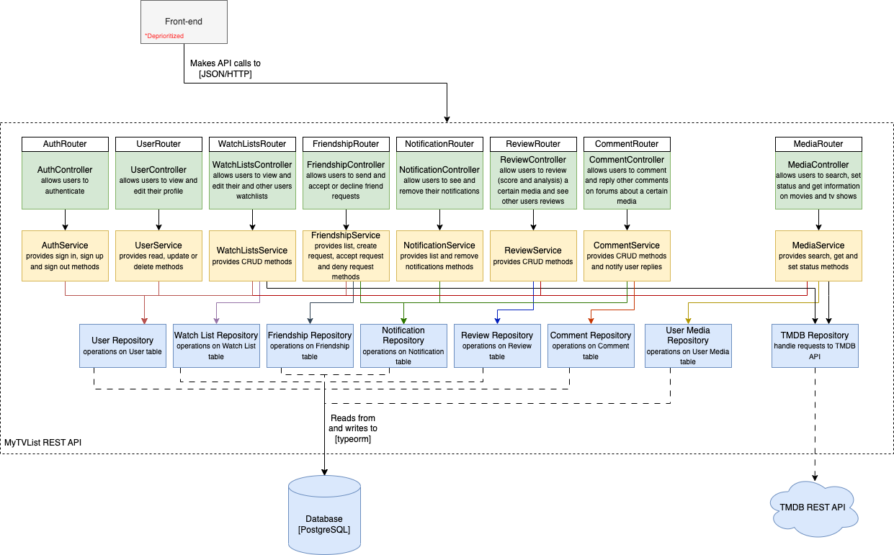

# MC426A-TV-Application

## Summary

This repository will be used in the course MC426 (Software Engineering) at Unicamp. The idea of the project is to create an application that will allow the user to create watchlists of TV Series and Movies, and interact adding recommendations, reviews, etc.

## Authors

| Username         | Name                       | RA     |
| ---------------- | -------------------------- | ------ |
| Miller-GS        | Gustavo Miller Santos      | 248320 |
| MonicaOkAl       | Mônica Okamoto Albrecht    | 174928 |
| GabrielleBarbosa | Gabrielle da Silva Barbosa | 233862 |
| Vinschers        | Felipe Scherer Vicentin    | 248283 |
| that-jpg         | Philipe Godoy              | 200073 |

## Introduction

Just like MyAnimeList (MAL), this website aims at helping its users to find, share and store data regarding TV series and movies that were watched.
This is done with the help of [TMDB API](https://www.themoviedb.org/documentation/api), which contains data from various shows, including its title, genre, synopsis, etc.

## Features

-   User authentication and registration: Allow users to create accounts, sign in, and manage their profiles.
-   Watchlists: Allow users to create and manage watchlists of TV series and movies they want to watch.
-   Search and browse: Allow users to search and browse for TV series and movies based on title, genre, actors, directors, etc.
-   Recommendations: Provide personalized recommendations to users based on their watch history, ratings, and preferences.
-   Reviews and ratings: Allow users to rate and review TV series and movies they have watched.

## Architecture
The architectural style of this project is **layered**, as described below:


### Front-End
Not a goal of this project. However, we're developing an API thinking of a possible front-end that could interact with the rest of the system.

### Back-End (REST API)
We're developing a REST API using Node JS. It will supply every route that a hypothetical front-end would need, such as authentication,
search, watchlists, notifications, reviews, and comments. Its architecture is clearly divided in four layers:
-   **Routers**: Responsible for receiving the request and redirecting it to the corresponding controller.
-   **Controllers**: Responsible for breaking down and interpreting the request, calling the appropriate service and formatting the response.
-   **Services** : Where the logic is located. They receive the broken down request, call repositories for data access and apply the business rules.
-   **Repositories**: Data access layer. Interact with the database or external APIs.

### PostgreSQL Database
Where the application data is located, such as users, comments, reviews, watchlists, and others. Everything except the movie and series database,
which comes from the TMDB external API.

### TMDB API
Short for [The Movie Database](https://www.themoviedb.org/documentation/api), the TMDB API is our source of data about movies and TV series. A repository
will send get requests to it.

## Build and Run

Don't forget to edit the `.env.example` file with your data and copy it to `.env`, both in the api folder and in the database folder.
You can do that automatically (copying the default values from the example) by running

```sh
make default-env-files
```

Then, to build and run, use the following commands:

```sh
make build && make up
```

Since we're using nodemon, you don't need to restart the containers for every change in the code.

## Run API tests

```sh
make test
```

## Contribution Guidelines

If you would like to contribute to the project, please follow these guidelines:

1. Fork the repository and create a new branch for your changes using proper [naming conventions](https://gist.github.com/seunggabi/87f8c722d35cd07deb3f649d45a31082)
2. Make your changes and test them locally
3. Submit a pull request with a detailed description of your changes and why they are necessary
4. Ensure that your code follows the project's coding standards and conventions
5. Respond to any feedback and make the necessary changes to your pull request

## License

This project is licensed under the MIT License. See [LICENSE](https://github.com/Miller-GS/MC426A-TV-Application/blob/main/LICENSE) for details.
